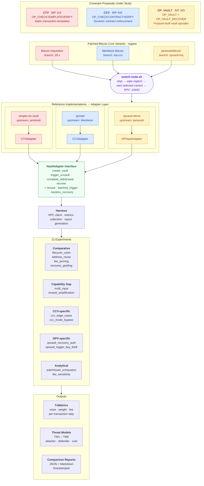

# Architecture

## Research Framework Overview

```mermaid
graph TB
    %% ── Layer 1: Covenant proposals ────────────────────────────
    subgraph proposals ["Covenant Proposals Under Study"]
        direction LR
        CTV["<b>CTV</b> · BIP 119<br/>OP_CHECKTEMPLATEVERIFY<br/><i>Static transaction templates</i>"]
        CCV["<b>CCV</b> · BIP 443<br/>OP_CHECKCONTRACTVERIFY<br/><i>Dynamic contract enforcement</i>"]
        OPV["<b>OP_VAULT</b> · BIP 345<br/>OP_VAULT + OP_VAULT_RECOVER<br/><i>Purpose-built vault opcodes</i>"]
    end

    %% ── Layer 2: Node infrastructure ───────────────────────────
    subgraph infra ["Patched Bitcoin Core Variants · regtest"]
        direction LR
        INQ["Bitcoin Inquisition<br/><i>branch: 29.x</i>"]
        MRK["Merkleize Bitcoin<br/><i>branch: inq-ccv</i>"]
        JOB["jamesob/bitcoin<br/><i>branch: opvault-inq</i>"]
    end

    SWITCH(["<b>switch-node.sh</b><br/><i>stop → wipe regtest → start selected variant → RPC :18443</i>"])

    %% ── Layer 3: Implementations → Adapters ────────────────────
    subgraph wrappers ["Reference Implementations → Adapter Layer"]
        direction LR

        subgraph ctv_col [" "]
            direction TB
            SCV["simple-ctv-vault<br/><i>upstream: jamesob</i>"]
            CTVA["CTVAdapter"]
            SCV --> CTVA
        end

        subgraph ccv_col [" "]
            direction TB
            PYM["pymatt<br/><i>upstream: Merkleize</i>"]
            CCVA["CCVAdapter"]
            PYM --> CCVA
        end

        subgraph opv_col [" "]
            direction TB
            OPD["opvault-demo<br/><i>upstream: jamesob</i>"]
            OPVA["OPVaultAdapter"]
            OPD --> OPVA
        end
    end

    %% ── Layer 4: Uniform interface ─────────────────────────────
    IFACE["<b>VaultAdapter Interface</b><br/>create_vault · trigger_unvault · complete_withdrawal · recover<br/>+ revault · batched_trigger · keyless_recovery"]

    %% ── Layer 5: Harness + Experiments ─────────────────────────
    HARNESS["<b>Harness</b><br/>RPC client · metrics collection · report generation"]

    subgraph experiments ["12 Experiments"]
        direction LR

        COMP["<b>Comparative</b><br/>lifecycle_costs<br/>address_reuse<br/>fee_pinning<br/>recovery_griefing"]
        CAP["<b>Capability Gap</b><br/>multi_input<br/>revault_amplification"]
        CSEC["<b>CCV-specific</b><br/>ccv_edge_cases<br/>ccv_mode_bypass"]
        OPSEC["<b>OPV-specific</b><br/>opvault_recovery_auth<br/>opvault_trigger_key_theft"]
        ANA["<b>Analytical</b><br/>watchtower_exhaustion<br/>fee_sensitivity"]
    end

    %% ── Layer 6: Outputs ───────────────────────────────────────
    subgraph outputs ["Outputs"]
        direction LR
        METRICS["<b>TxMetrics</b><br/>vsize · weight · fee<br/>per transaction step"]
        THREATS["<b>Threat Models</b><br/>TM1 – TM8<br/>attacker · defender · cost"]
        RESULTS["<b>Comparison Reports</b><br/>JSON + Markdown<br/>timestamped"]
    end

    %% ── Connections ────────────────────────────────────────────
    CTV ~~~ INQ
    CCV ~~~ MRK
    OPV ~~~ JOB

    INQ --> SWITCH
    MRK --> SWITCH
    JOB --> SWITCH
    SWITCH --> wrappers

    CTVA --> IFACE
    CCVA --> IFACE
    OPVA --> IFACE

    IFACE --> HARNESS
    HARNESS --> experiments
    experiments --> outputs

    %% ── Styles ─────────────────────────────────────────────────
    classDef red fill:#fee2e2,stroke:#ef4444,color:#991b1b
    classDef blue fill:#dbeafe,stroke:#3b82f6,color:#1e40af
    classDef amber fill:#fef3c7,stroke:#f59e0b,color:#92400e
    classDef green fill:#f0fdf4,stroke:#16a34a,color:#166534
    classDef purple fill:#f5f3ff,stroke:#7c3aed,color:#5b21b6

    class CTV,INQ,SCV,CTVA red
    class CCV,MRK,PYM,CCVA blue
    class OPV,JOB,OPD,OPVA amber
    class IFACE green
    class SWITCH purple
```
